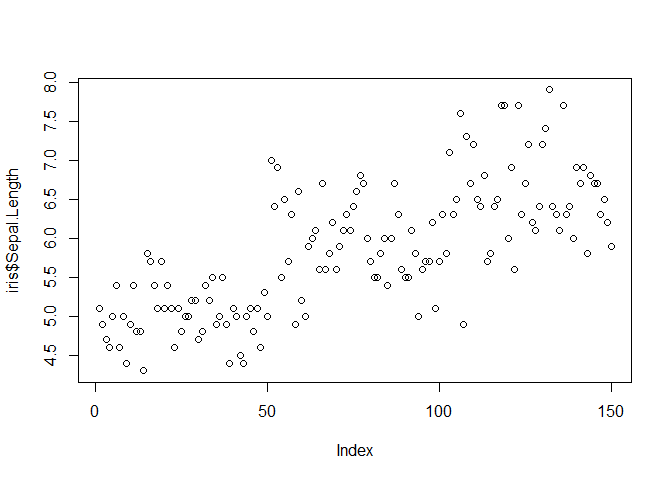

---

## Running code


```r
# some data analysis
summary(iris)
```

```
##   Sepal.Length    Sepal.Width     Petal.Length    Petal.Width   
##  Min.   :4.300   Min.   :2.000   Min.   :1.000   Min.   :0.100  
##  1st Qu.:5.100   1st Qu.:2.800   1st Qu.:1.600   1st Qu.:0.300  
##  Median :5.800   Median :3.000   Median :4.350   Median :1.300  
##  Mean   :5.843   Mean   :3.057   Mean   :3.758   Mean   :1.199  
##  3rd Qu.:6.400   3rd Qu.:3.300   3rd Qu.:5.100   3rd Qu.:1.800  
##  Max.   :7.900   Max.   :4.400   Max.   :6.900   Max.   :2.500  
##        Species  
##  setosa    :50  
##  versicolor:50  
##  virginica :50  
##                 
##                 
## 
```

## Including Plots


```r
# embed a plot
plot(iris$Sepal.Length)
```

<!-- -->

---


### The RMarkdown .rmd code used to build the HTML output is in the box below

    ---
    title: "Embedding and Executing Code"
    author: "Student R. Me"
    date: "`r format(Sys.time(), '%d %B, %Y')`"
    html_document:
        keep_md: true
    pdf_document: default
    word_document: default  
    ---
    
    ---
    
    ## Running code
    
    ```{r iris_sum}
    # some data analysis
    summary(iris)
    ```
    
    ## Including Plots
    
    ```{r iris_plot}
    # embed a plot
    plot(iris$Sepal.Length)
    ```
    
    NOTE that both chunks have been named, iris_sum and iris_plot, respectively.  
    Naming chunks can be useful for debugging purposes.
    
    ---
