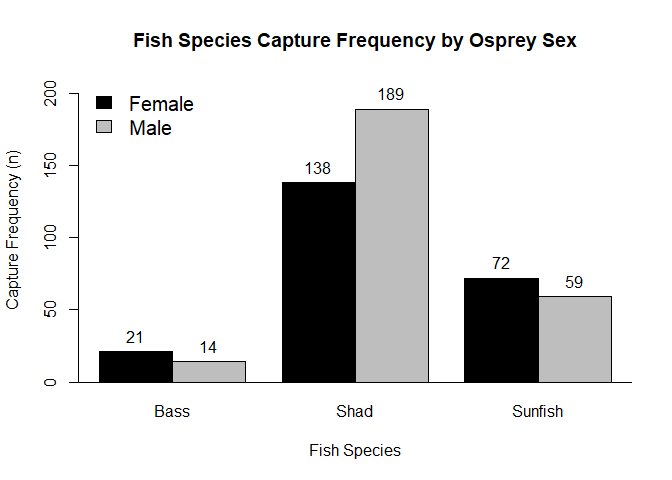
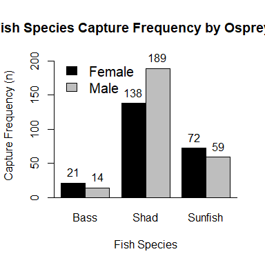
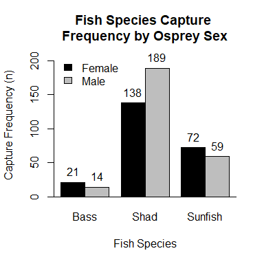

<!-- set root directory here --> 
<!-- your directory will be specific to you -->


---

---

## Data for figure construction


```r
# import data and examine dataframe characteristics
  f1 <- read.csv("data/ospreypreybysex.csv", header = T)
  f2 <- xtabs(count ~ ospreysex + fishspp, data = f1)  # cross-tab the data
  f2
```

```
##          fishspp
## ospreysex Bass Shad Sunfish
##    Female   21  138      72
##    Male     14  189      59
```

---

## Default figure

Figure size is approximately 6.7 $\times$ 6.7 inches.


```r
# embed a barplot; assumes object f1 & f2 from above
  freq.r <- range(0, signif(max(f1$count), 1) + 10)  # use raw data for ylim= range
  bplot1 <- barplot(f2, ylim = freq.r, xlab = "Fish Species", 
    ylab = "Capture Frequency (n)", space = c(0, 0.5), col = c("black", "grey"), beside = T)
  abline(h = 0)  # add line to bottom of plot

# add legend
  legend("topleft", c("Female", "Male"), fill = c("black", "grey"), bty = "n", cex = 1.25)
  title(main = "Fish Species Capture Frequency by Osprey Sex")
  text(x = bplot1, y = c(f2[1:6]), labels = c(f2[1:6]), pos = 3)  # adds f2 counts above
```

<!-- -->

---

## Figure with specified 4 $\times$ 4 inch size

Note "clipped" figure caption, and "large" legend labels.


```r
# embed a barplot; assumes object f1 & f2 from above
  freq.r <- range(0, signif(max(f1$count), 1) + 10)  # use raw data for ylim= range
  bplot1 <- barplot(f2, ylim = freq.r, xlab = "Fish Species", 
    ylab = "Capture Frequency (n)", space = c(0, 0.5), col = c("black", "grey"), beside = T)
  abline(h = 0)  # add line to bottom of plot

# add legend
  legend("topleft", c("Female", "Male"), fill = c("black", "grey"), bty = "n", cex = 1.25)
  title(main = "Fish Species Capture Frequency by Osprey Sex")
  text(x = bplot1, y = c(f2[1:6]), labels = c(f2[1:6]), pos = 3)  # adds f2 counts above
```

<!-- -->

---

## Modified figure with specified 4 $\times$ 4 inch size

Note insertion of standard R line break `\n` syntax to break figure caption into two lines.  This corrects "clipped" caption from above.  Legend `cex =` is reduced from `1.25` to the default for visual purposes as well.


```r
# embed a barplot; assumes object f1 & f2 from above
  freq.r <- range(0, signif(max(f1$count), 1) + 10)  # use raw data for ylim= range
  bplot1 <- barplot(f2, ylim = freq.r, xlab = "Fish Species", 
    ylab = "Capture Frequency (n)", space = c(0, 0.5), col = c("black", "grey"), beside = T)
  abline(h = 0)  # add line to bottom of plot

# add legend
  legend("topleft", c("Female", "Male"), fill = c("black", "grey"), bty = "n")
  title(main = "Fish Species Capture \nFrequency by Osprey Sex")
  text(x = bplot1, y = c(f2[1:6]), labels = c(f2[1:6]), pos = 3)  # adds f2 counts above
```

<!-- -->

## Ouput a different format: Example PDF


```r
# create a duplicate of figure in PDF format: NOT RUN
  pdf("outfigs/osprey_preyselection.pdf") # set PATH & assign filename

# INSERT GRAPH CODE HERE

# write-out file after build
  dev.off()
```


    


---

### The RMarkdown .rmd code used to build the HTML output is in the box below

    ---
    title: "Figures in **R**Markdown"
    author: "Student R. Me"
    date: "`r format(Sys.time(), '%d %B, %Y')`"
    output: 
        html_document:
            keep_md: true
        pdf_document: default
        word_document: default
    ---
    
    
    <!-- set root directory here --> 
    <!-- your directory will be specific to you -->
    ```{r global_options, include=FALSE}
    knitr::opts_knit$set(root.dir = "~/words/github/useRfiles/rmd-files")
    knitr::opts_chunk$set(warning=FALSE)
    ```
    
    ---
    
    ---
    
    ## Data for figure construction
    
    ```{r}
    # import data and examine dataframe characteristics
      f1 <- read.csv("data/ospreypreybysex.csv", header = T)
      f2 <- xtabs(count ~ ospreysex + fishspp, data = f1)  # cross-tab the data
      f2
    ```
    
    ---
    
    ## Default figure
    
    Figure size is approximately 6.7 $\times$ 6.7 inches.
    
    ```{r}
    # embed a barplot; assumes object f1 & f2 from above
      freq.r <- range(0, signif(max(f1$count), 1) + 10)  # use raw data for ylim= range
      bplot1 <- barplot(f2, ylim = freq.r, xlab = "Fish Species", 
        ylab = "Capture Frequency (n)", space = c(0, 0.5), col = c("black", "grey"), beside = T)
      abline(h = 0)  # add line to bottom of plot
    
    # add legend
      legend("topleft", c("Female", "Male"), fill = c("black", "grey"), bty = "n", cex = 1.25)
      title(main = "Fish Species Capture Frequency by Osprey Sex")
      text(x = bplot1, y = c(f2[1:6]), labels = c(f2[1:6]), pos = 3)  # adds f2 counts above
    ```
    
    ---
    
    ## Figure with specified 4 $\times$ 4 inch size
    
    Note "clipped" figure caption, and "large" legend labels.
    
    ```{r, fig.width=4, fig.height=4}
    # embed a barplot; assumes object f1 & f2 from above
      freq.r <- range(0, signif(max(f1$count), 1) + 10)  # use raw data for ylim= range
      bplot1 <- barplot(f2, ylim = freq.r, xlab = "Fish Species", 
        ylab = "Capture Frequency (n)", space = c(0, 0.5), col = c("black", "grey"), beside = T)
      abline(h = 0)  # add line to bottom of plot
    
    # add legend
      legend("topleft", c("Female", "Male"), fill = c("black", "grey"), bty = "n", cex = 1.25)
      title(main = "Fish Species Capture Frequency by Osprey Sex")
      text(x = bplot1, y = c(f2[1:6]), labels = c(f2[1:6]), pos = 3)  # adds f2 counts above
    ```
    
    ---
    
    ## Modified figure with specified 4 $\times$ 4 inch size
    
    Note insertion of standard R line break `\n` syntax to break figure caption into two lines.  This corrects "clipped" caption from above.  Legend `cex =` is reduced from `1.25` to the default for visual purposes as well.
    
    ```{r, fig.width=4, fig.height=4}
    # embed a barplot; assumes object f1 & f2 from above
      freq.r <- range(0, signif(max(f1$count), 1) + 10)  # use raw data for ylim= range
      bplot1 <- barplot(f2, ylim = freq.r, xlab = "Fish Species", 
        ylab = "Capture Frequency (n)", space = c(0, 0.5), col = c("black", "grey"), beside = T)
      abline(h = 0)  # add line to bottom of plot
    
    # add legend
      legend("topleft", c("Female", "Male"), fill = c("black", "grey"), bty = "n")
      title(main = "Fish Species Capture \nFrequency by Osprey Sex")
      text(x = bplot1, y = c(f2[1:6]), labels = c(f2[1:6]), pos = 3)  # adds f2 counts above
    ```
    
    ## Ouput a different format: Example PDF

    ```{r, eval=F, fig.width=4, fig.height=4, fig.path="outfigs/"}
    # create a duplicate of figure in PDF format: NOT RUN
      pdf("outfigs/osprey_preyselection.pdf") # set PATH & assign filename
    
    # INSERT GRAPH CODE HERE
    
    # write-out file after build
      dev.off()
    ```
    
    ---


