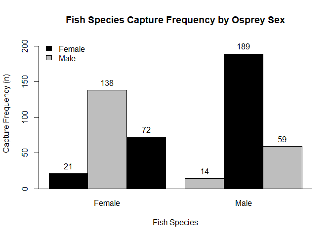

<!-- set root directory here --> 
<!-- your directory will be specific to you -->


---

---

## Homework \#1

---

### The Question

A study was undertaken to explore the foraging behavior of adult ospreys during the breeding season.  The first of several questions asked was whether prey choice (capture) was independent of osprey sex during the 3-month breeding season.  Individual male and female ospreys were watched and the species of fish captured was recorded.  

Objectives were to:

* Determine if prey selection was independent of osprey sex
* Build a plot of the data.
* Examine standardized residuals.

---

### The Analysis Using R

First import the data, then examine the data:


```r
# import data from external .csv file
  osprey <- read.csv("data/ospreypreybysex.csv", header = T)
  osprey  # examine raw data
```

```
##   ospreysex fishspp count
## 1      Male Sunfish    59
## 2    Female Sunfish    72
## 3      Male    Bass    14
## 4    Female    Bass    21
## 5      Male    Shad   189
## 6    Female    Shad   138
```

Next create a cross-tabulated table of frequencies by fish species and osprey sex.


```r
# crosstabs to mimic data table
  osprey.xtab <- xtabs(count ~ fishspp + ospreysex, data = osprey)
  osprey.xtab  # examine cross-tabulated data
```

```
##          ospreysex
## fishspp   Female Male
##   Bass        21   14
##   Shad       138  189
##   Sunfish     72   59
```

Construct a barplot of the capture frequencies.


```r
# embed a barplot
  freq.r <- range(0, signif(max(osprey$count), 1) + 10)  # use raw data for ylim= range
  bplot1 <- barplot(osprey.xtab, ylim = freq.r, xlab = "Fish Species", 
    ylab = "Capture Frequency (n)", space = c(0, 0.5), col = c("black", "grey"), beside = T)
  abline(h = 0)  # add line to bottom of plot

# add legend
  legend("topleft", c("Female", "Male"), fill = c("black", "grey"), bty = "n", cex = 1)
  title(main = "Fish Species Capture Frequency by Osprey Sex")
  text(x = bplot1, y = c(osprey.xtab[1:6]), labels = c(osprey.xtab[1:6]), pos = 3)  # adds osprey.xtab counts above
```

<!-- -->

Implement the $\chi^2$ test, examine output, and see what objects are available after the analysis.


```r
# Pearson chisq 
  osprey.chi2 <- chisq.test(osprey.xtab)  # chisq test
  osprey.chi2  # output from chisq test
```

```
## 
## 	Pearson's Chi-squared test
## 
## data:  osprey.xtab
## X-squared = 8.7294, df = 2, p-value = 0.01272
```

```r
  ls(osprey.chi2)  # available objects from chisq test
```

```
## [1] "data.name" "expected"  "method"    "observed"  "p.value"   "parameter"
## [7] "residuals" "statistic" "stdres"
```

Last, examine some diagnostics for interpretation, especially the standardized residuals.  The standardized residuals provide an indication where deviations for expected capture frequencies deviate.


```r
# examine diet preferences by sex
  chisq.test(osprey.xtab)$observed  # observed captures
```

```
##          ospreysex
## fishspp   Female Male
##   Bass        21   14
##   Shad       138  189
##   Sunfish     72   59
```

```r
  chisq.test(osprey.xtab)$expected  # expected captures
```

```
##          ospreysex
## fishspp      Female      Male
##   Bass     16.39959  18.60041
##   Shad    153.21907 173.78093
##   Sunfish  61.38134  69.61866
```

```r
  100 * osprey.xtab/apply(osprey.xtab, 1, sum)  # percent captures
```

```
##          ospreysex
## fishspp     Female     Male
##   Bass    60.00000 40.00000
##   Shad    42.20183 57.79817
##   Sunfish 54.96183 45.03817
```

```r
  chisq.test(osprey.xtab)$stdres  # standardized residuals
```

```
##          ospreysex
## fishspp      Female      Male
##   Bass     1.616751 -1.616751
##   Shad    -2.906524  2.906524
##   Sunfish  2.169669 -2.169669
```

---

### Interpretation

Male and female ospreys differ in their diets ($\chi^2$ = 8.729, *p* = 0.013, *df* = 2).  Shad makes up more than half the diet of both male and female birds, but for the males it is over 72%, whereas for the females it is about 60%.  Proportionally, bass and sunfish make up slightly smaller portions of the average male's diet than in the female's diet.  

Overall, both males and females appear to be selecting bass at approximately their relative availability.  Males preferentially capture shad at higher proportions than expected, while under-utilizing sunfish.  Females preferentially capture sunfish and ignore shad.

---

### The RMD code used to build the HTML output is in the box below

    ---
    title: "A Final **R**Markdown Document in HTML Format"
    author: "Student R. Me"
    date: "10 September, 2019"
    output: 
        html_document:
            keep_md: true
        pdf_document: default
        word_document: default
    ---
    
    <!-- set root directory here --> 
    <!-- your directory will be specific to you -->
    ```{r global_options, include=FALSE}
    knitr::opts_knit$set(root.dir = "~/words/github/useRfiles/rmd-files")
    knitr::opts_chunk$set(warning=FALSE)
    ```
    
    ---
    
    ---
    
    ## Homework \#1
    
    ---
    
    ### The Question
    
    A study was undertaken to explore the foraging behavior of adult ospreys during the breeding season.  The first of several questions asked was whether prey choice (capture) was independent of osprey sex during the 3-month breeding season.  Individual male and female ospreys were watched and the species of fish captured was recorded.  
    
    Objectives were to:
    
    * Determine if prey selection was independent of osprey sex
    * Build a plot of the data.
    * Examine standardized residuals.
    
    ---
    
    ### The Analysis Using R
    
    First import the data, then examine the data:
    
    ```{r}
    # import data from external .csv file
      osprey <- read.csv("data/ospreypreybysex.csv", header = T)
      osprey  # examine raw data
    ```
    
    Next create a cross-tabulated table of frequencies by fish species and osprey sex.
    
    ```{r}
    # crosstabs to mimic data table
      osprey.xtab <- xtabs(count ~ fishspp + ospreysex, data = osprey)
      osprey.xtab  # examine cross-tabulated data
    ```
    
    Construct a barplot of the capture frequencies.
    
    ```{r}
    # embed a barplot
      freq.r <- range(0, signif(max(osprey$count), 1) + 10)  # use raw data for ylim= range
      bplot1 <- barplot(osprey.xtab, ylim = freq.r, xlab = "Fish Species", 
        ylab = "Capture Frequency (n)", space = c(0, 0.5), col = c("black", "grey"), beside = T)
      abline(h = 0)  # add line to bottom of plot
    
    # add legend
      legend("topleft", c("Female", "Male"), fill = c("black", "grey"), bty = "n", cex = 1)
      title(main = "Fish Species Capture Frequency by Osprey Sex")
      text(x = bplot1, y = c(osprey.xtab[1:6]), labels = c(osprey.xtab[1:6]), pos = 3)  # adds osprey.xtab counts above
    ```
    
    Implement the $\chi^2$ test, examine output, and see what objects are available after the analysis.
    
    ```{r}
    # Pearson chisq 
      osprey.chi2 <- chisq.test(osprey.xtab)  # chisq test
      osprey.chi2  # output from chisq test
      ls(osprey.chi2)  # available objects from chisq test
    ```
    
    Last, examine some diagnostics for interpretation, especially the standardized residuals.  The standardized residuals provide an indication where deviations for expected capture frequencies deviate.
    
    ```{r}
    # examine diet preferences by sex
      chisq.test(osprey.xtab)$observed  # observed captures
      chisq.test(osprey.xtab)$expected  # expected captures
      100 * osprey.xtab/apply(osprey.xtab, 1, sum)  # percent captures
      chisq.test(osprey.xtab)$stdres  # standardized residuals
    ```
    
    ---
    
    ### Interpretation
    
    Male and female ospreys differ in their diets ($\chi^2$ = `r round(osprey.chi2$statistic, 3)`, *p* = `r round(osprey.chi2$p.value, 3)`, *df* = `r osprey.chi2$parameter`).  Shad makes up more than half the diet of both male and female birds, but for the males it is over 72%, whereas for the females it is about 60%.  Proportionally, bass and sunfish make up slightly smaller portions of the average male's diet than in the female's diet.  
    
    Overall, both males and females appear to be selecting bass at approximately their relative availability.  Males preferentially capture shad at higher proportions than expected, while under-utilizing sunfish.  Females preferentially capture sunfish and ignore shad.
    
    ---
